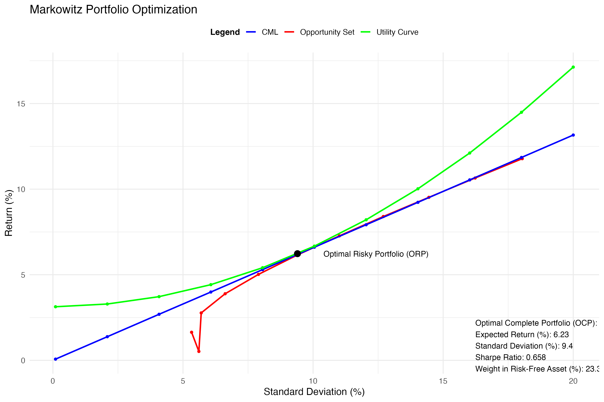

# A Mean-Variance Portfoilio Optimization in R 
The portfolio consists of 
1. **Risk-Free Asset:** _Treasury Bills (T-Bills)_
2. **Risky Assets:**_MSCI WORLD ESG: A global ESG focused equity index & S&P 500: A benchmark index_

